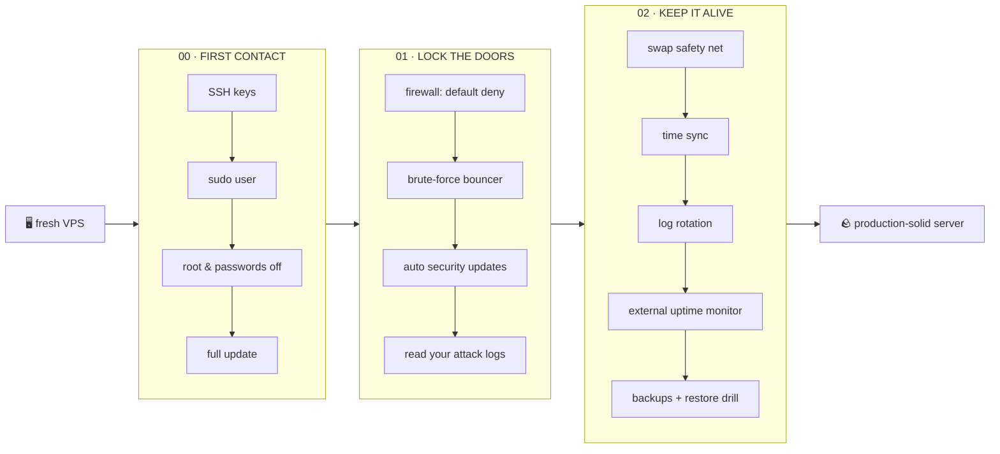

<div align="center">

# ✅ server-to-do

**The fresh-VPS to-do list you can hand to an AI agent.**

[](LICENSE)
[](https://github.com/RinDig/icm-architect)
[](CONTRIBUTING.md)


*Spin up a server. Clone this repo. Tell your agent: "run it on my server."*
*Levels 0 → 2, one verified step at a time — with a human gate on everything that can hurt.*

</div>

---

## Why this exists

Every new VPS starts the same way: a root password, a thousand bots already knocking, and a mental checklist you're *sure* you'll remember this time. You won't. Nobody does.

**server-to-do** is that checklist, written down properly: OS-agnostic, goal-first, safety-obsessed — and structured with [ICM](https://github.com/RinDig/icm-architect) so an AI agent can walk it end-to-end while you approve each step. Vibe coders welcome: every card explains itself twice, once 🧒 simple, once 🛠 technical.



## The levels

| Level | Mission | Time | You'll never again… |
|---|---|---|---|
| **00 · First Contact** | Key-based login, non-root sudo user, root+passwords disabled, full system update | ~30 min | …get pwned by a password-guessing bot |
| **01 · Lock the Doors** | Default-deny firewall, fail2ban-style bouncer, automatic security updates, meet your attackers | ~30 min | …run an open door you didn't mean to open |
| **02 · Keep It Alive** | Swap, NTP, log rotation, external uptime alerts, tested backups | ~75 min | …lose data and call it a learning experience |
| **03+ · Going Pro** | *your ideas here — see [Contributing](#contributing)* | — | — |

Each step is a **card**: risk level, reversibility, simple explanation, techie commands per OS family, exact verification, one human gate, and a rollback path. No step checks its own box — verification does.

## 🚀 For humans

```bash
git clone https://github.com/kiarash-na/server-to-do.git
cd server-to-do
cp _templates/run-instance.md runs/my-server.md   # fill in your server's details
```

Then read `00_first-contact/` top to bottom and do the steps — or let an agent drive (below). Take your provider's **snapshot** before step 1. It's the undo button.

## 🤖 For AI agents (and the vibe coders who drive them)

This repo is an [ICM](https://github.com/RinDig/icm-architect) pipeline: the folder structure *is* the program. Point any agent at it:

> *"Here's the server-to-do repo. Follow `CLAUDE.md`, obey `_shared/safety-rules.md`, and run the pipeline on `runs/my-server.md`. Stop at every human check."*

The agent will orient from `CLAUDE.md`, work the numbered cards in order, verify each one with read-only commands, and **stop for your confirmation** before anything risky. Progress lives in your run file — close the session, come back tomorrow, any agent can resume from the checkboxes.

## 🛡 The safety contract

[`_shared/safety-rules.md`](_shared/safety-rules.md) is the heart of this repo. Seven rules, binding on human and agent alike:

1. **Scan before you change** — read-only first, always
2. **One step at a time, in order**
3. **Destructive commands need your explicit yes** — shown verbatim, every time
4. **Double-gate on lockout risks** — new session proven before the old one closes
5. **Every step verified** — or the box stays unchecked
6. **Failed verification = stop**, not improvisation
7. **Snapshot first** — the universal undo

## Design principles

- **Goal-first, OS-agnostic.** Cards say *what must be true*, then show how on Ubuntu/Debian, RHEL-family, Alpine. Unlisted OS? The agent adapts commands toward the stated goal.
- **Arrangements, not vendors.** "Have an external uptime monitor" is a step; "sign up for UptimeRobot" is not. Tools age; goals don't.
- **Markdown is the state.** No databases, no dashboards — checkboxes in a file you own.
- **The structure is the documentation.** A newcomer (human or agent) can understand the whole system by reading `CONTEXT.md` files top to bottom.

## Contributing

New levels and steps are the point. Copy `_templates/step-card.md` (every section is mandatory), or `_templates/level-CONTEXT.md` for a whole new `03_…` level. Keep the dual 🧒/🛠 voices, keep verification literal, keep the human gate. Then open a PR.

Ideas already floating: `03_going-pro` (reverse-proxy origin locking, container resource limits, kernel livepatch), `04_fleet-life` (second server, config management, secrets handling)…

## License

[MIT](LICENSE) — take it, fork it, run it on everything you own.
