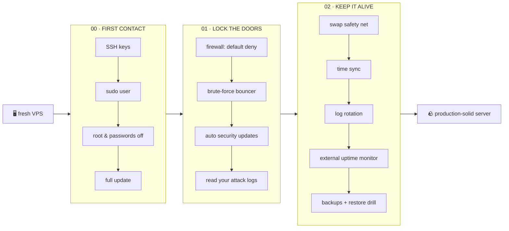

<div align="center">

# ✅ server-to-do

**The fresh-VPS to-do list you hand to an AI agent.**

[](LICENSE)
[](https://github.com/RinDig/icm-architect)
[](CONTRIBUTING.md)


*Spin up a server. Clone this. Tell your agent: "run it."*
*One verified step at a time — with a human gate on everything that can hurt.*

</div>

---

Every new VPS starts the same way: a root password, a thousand bots already knocking, and a checklist you're *sure* you'll remember. You won't. **server-to-do** is that checklist, written down: OS-agnostic, goal-first, safety-obsessed, structured with [ICM](https://github.com/RinDig/icm-architect) so any agent can walk it while you approve each step. Every card explains itself twice — once 🐣 simple, once 💀 technical.



| Level | Mission | Time |
|---|---|---|
| **00 · First Contact** | Keys in, root out, system updated | ~30 min |
| **01 · Lock the Doors** | Firewall, bouncer, auto-updates, meet your attackers | ~30 min |
| **02 · Keep It Alive** | Swap, time, logs, uptime alerts, tested backups | ~75 min |
| **03+ · Going Pro** | *your ideas — see [Contributing](#contributing)* | — |

## 🚀 For humans

```bash
git clone https://github.com/kiarash-na/server-to-do.git
cd server-to-do
cp _templates/run-instance.md runs/my-server.md   # fill the facts table
```

Take your provider's **snapshot** (the undo button), then work the levels top to bottom — or let an agent drive 👇.

## 🤖 For AI agents

> *"Follow `CLAUDE.md`, obey `_shared/safety-rules.md`, run the pipeline on `runs/my-server.md`. Stop at every human check."*

That's the whole prompt. The agent works the numbered cards, verifies each with read-only commands, and stops for your yes before anything risky. Progress lives in the run file — any agent can resume from the checkboxes.

## 🛡 The safety contract

[`_shared/safety-rules.md`](_shared/safety-rules.md) — seven rules binding human and agent alike: scan before change · one step at a time · destructive = explicit yes, shown verbatim · double-gate on lockouts · verify or it didn't happen · failed verify = stop · snapshot first.

## Contributing

Something unclear, outdated, or missing? **Open an issue or a PR — humans and agents both welcome.** Agents: if you adapted or improved a step during a run, push it as a PR so the next server gets it too. New steps: copy `_templates/step-card.md`. New levels: copy `_templates/level-CONTEXT.md`. Details in [CONTRIBUTING.md](CONTRIBUTING.md).

## License

[MIT](LICENSE) — take it, fork it, run it on everything you own.
